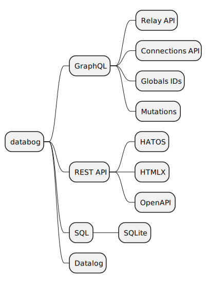

# Introduction

TODO This is still inspirational. Using a document first approach.

This document is a collection of essays and tutorials about building
data driven APIs. It covers REST, GraphQL and more. Included in this
project is a tool called databog. Its similar to pandoc, but for APIs
and data modeling, and validation

Included in the project are a collection of tools for parsing OpenAPI
and GraphQL schemas and working with them.

With Databog you can write an API in GraphQL, start a command line
server and have a working GraphQL or REST API in seconds. Databog will
inspect your schema and generated sensible data. You can then use
databog to iteration your web application development.

## Run a fake GraphQL Server

TODO

``` shell
databog graphql server --schema-file schema.graphql
```

## Statically check your GraphQL queries and schema files.

TODO

``` shell
databog graphql check --schema-file schema.graphql --queries queries
```

## GraphQL Query coverage

TODO

``` shell
databog graphql coverage --schema-file schema.graphql --queries queries
```

## Check grammar

TODO

    databog graphql check-grammar --schema-file schema.graphql --queries queries



## Install

### Clojure

[Clojure cli](https://clojure.org/guides/install_clojure)

``` shell
brew install pandoc
```

### Pandoc

[Pandoc](https://pandoc.org/)

``` shell
brew install pandoc
```

## babashka

[babashka](https://babashka.org/)

``` shell
brew install borkdude/brew/babashka
```

</body>
</html>
