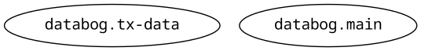

# Databog

A library for managing Datalog database systems.



<!-- markdown-toc start - Don't edit this section. Run M-x markdown-toc-refresh-toc -->
**Table of Contents**

- [Databog](#databog)
  - [Ideas](#ideas)
  - [Install](#install)
  - [Test](#test)
  - [Type Check](#type-check)
  - [Documentations](#documentations)

<!-- markdown-toc end -->


## Ideas/Roadmap

- [] DOING Typed Clojure annonations for Datom/Datalog datoms
- [] TODO Catalog System for Datalog Attributes
- [] TODO Example Schema and implementation with [Datahike](https://github.com/replikativ/datahike)
- [] TODO Clojure Parsing and Code generations tools
- [] TODO GraphQL generation from Datalog Attributes
- [] TODO GraphQL validator
- [] TODO GraphQL Code Coverage
- [] TODO GraphQL Fake API backed by in memory DataHike database
- [] TODO TypedClojure -> GraphQL?
- [] TODO isort for clojure?


## Install

1. [Clojure/JVM](https://clojure.org/)
2. [Babashka](https://babashka.org/)
3. [Pandoc](https://pandoc.org/)

```shell
bb main
```


## Test

```shell
bb test
```


## Type Check

```shell
bb type-check
```


## Documentations

```shell
bb docs
```


Process readme markdown file

```shell
pandoc -f markdown -t json readme.md | jet --from json --to edn --keywordize > readme.edn
pandoc -f markdown -t json readme.md --filter bin/t-pandoc
```
